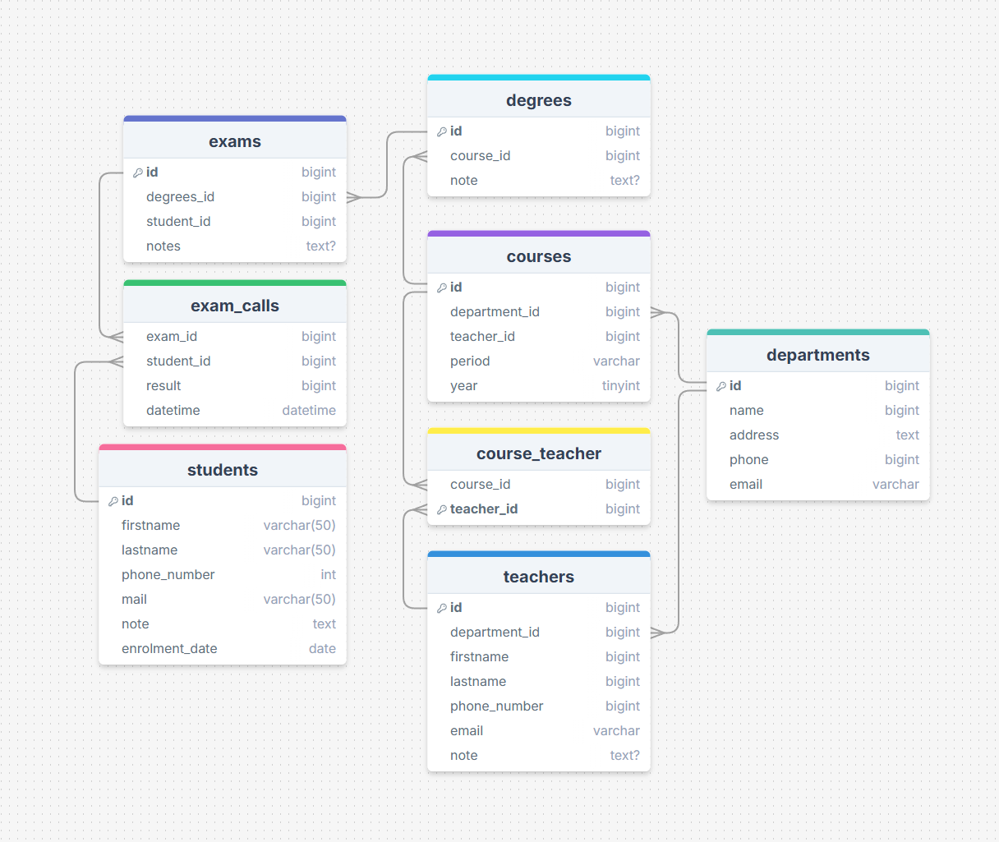

 
 

Esercizio #45 | Classe 137 | Boolean Academy

---

Studente: Fabio Ferrero

---
# English

## Target of the project:
Model the structure of a database to store all data concerning a university:
- there are several Departments (e.g., Humanities, Mathematics, Engineering, etc.);
- each Department offers multiple Degree Courses (e.g., Classical Civilization and Literature, Computer Science, Electrical Engineering, etc.).
- each Degree Course offers several Courses (e.g., Latin Literature, Operating Systems 1, Mathematical Analysis 2, etc.);
- each Course may be taught by different Teachers;
- each Course has multiple Examination dates;
- each Student is enrolled in only one Degree Course;
- each Student may register for more than one Examination roll;
- for each Examination roll in which the Student has participated, it is necessary to memorize the grade obtained, even if not sufficient.

Let us think about which entities (tables) to create for our database and then try to establish their relationships. Finally, we go on to define the columns and data types for each table.

---
# Italiano

## Obiettivo del progetto:
Modellizzare la struttura di un database per memorizzare tutti i dati riguardanti una università:
- sono presenti diversi Dipartimenti (es.: Lettere e Filosofia, Matematica, Ingegneria ecc.);
- ogni Dipartimento offre più Corsi di Laurea (es.: Civiltà e Letterature Classiche, Informatica, Ingegneria Elettronica ecc..)
- ogni Corso di Laurea prevede diversi Corsi (es.: Letteratura Latina, Sistemi Operativi 1, Analisi Matematica 2 ecc.);
- ogni Corso può essere tenuto da diversi Insegnanti;
- ogni Corso prevede più appelli d’Esame;
- ogni Studente è iscritto ad un solo Corso di Laurea;
- ogni Studente può iscriversi a più appelli di Esame;
- per ogni appello d’Esame a cui lo Studente ha partecipato, è necessario memorizzare il voto ottenuto, anche se non sufficiente.

Pensiamo a quali entità (tabelle) creare per il nostro database e cerchiamo poi di stabilirne le relazioni. Infine, andiamo a definire le colonne e i tipi di dato di ogni tabella.

---

